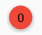
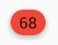
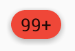
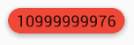

# MaterialBadgeTextView
As the name describes, This "MaterialBadgeTextView" is an Android library that provides a reformed textview for Badge. A Badge is a colored circle with an inserted number which are displayed at the top-right conner of the icons, it often plays a role of showing new messages or new features in IM apps such as **Facebook Messager, WhatsApp, WeChat**, and forth.

## Features
1. Material Design style - it provides a default shadow like FAB(Floating Action Bar)
2. Easy to use - you can just use it as a normal TextView
3. Really Lite - only ONE java class, no resource file
4. Support MenuAction in Toolbar

If you use mac OS X, you must have seen this image:
  

## Demo Screen Capture

## Usage
| Code | Badge |
| :----- | :------ | 
| **`setBadgeCount(0,true)`** | the TextView is blank |
| **`setBadgeCount(0,false)`** |  |
| **`setBadgeCount(3)`** |  |
| **`setBadgeCount(68)`** |  |
| **`setBadgeCount(101)`** |  |
| **`setBadgeCount(99999)`** |  |
| **`setHighLightMode()`** |  |
| **`setText("")`** | the TextView is blank |
| **`setText("Hello World!")`** |  |
| **`setText("10999999976")`** |  |

## Compat
API level 9+ supported

## Example
See example code here on Github. You can also see it live downloading [this apk](https://raw.githubusercontent.com/matrixxun/MaterialBadgeTextView/master/MaterialBadgeTextView/apk/app-debug.apk)

License
--------

    Licensed under the Apache License, Version 2.0 (the "License");
    you may not use this file except in compliance with the License.
    You may obtain a copy of the License at

       http://www.apache.org/licenses/LICENSE-2.0

    Unless required by applicable law or agreed to in writing, software
    distributed under the License is distributed on an "AS IS" BASIS,
    WITHOUT WARRANTIES OR CONDITIONS OF ANY KIND, either express or implied.
    See the License for the specific language governing permissions and
    limitations under the License.
